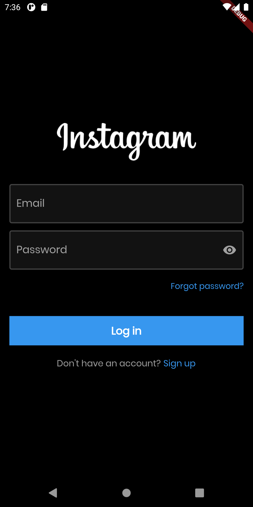
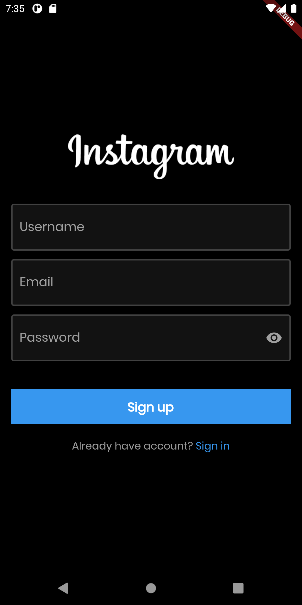
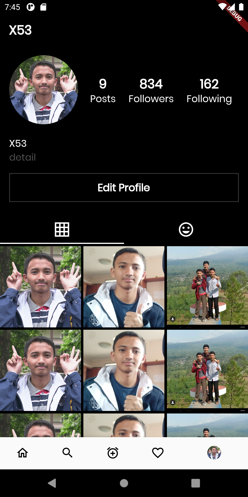
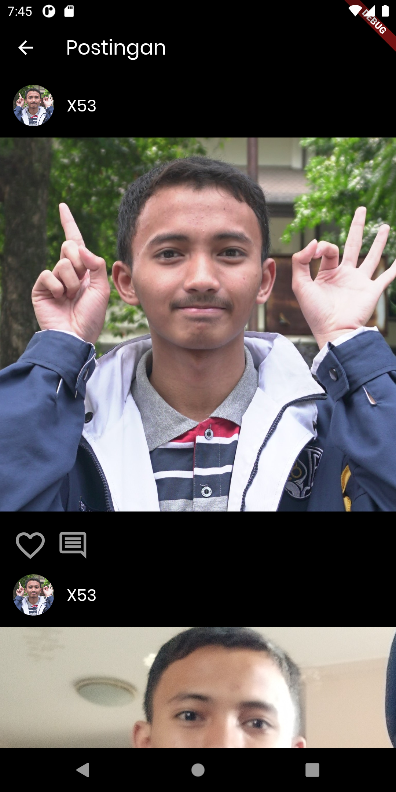

# instagram_ui_clone

This project is for flutter learning purpose. Isn't perfect yet, but I'll do my best to continue this project soon.

## Screenshot

  
  
  
  

## Dependencies

- Dio
- GetX
- Google Fonts
- Scrollable Positioned List
